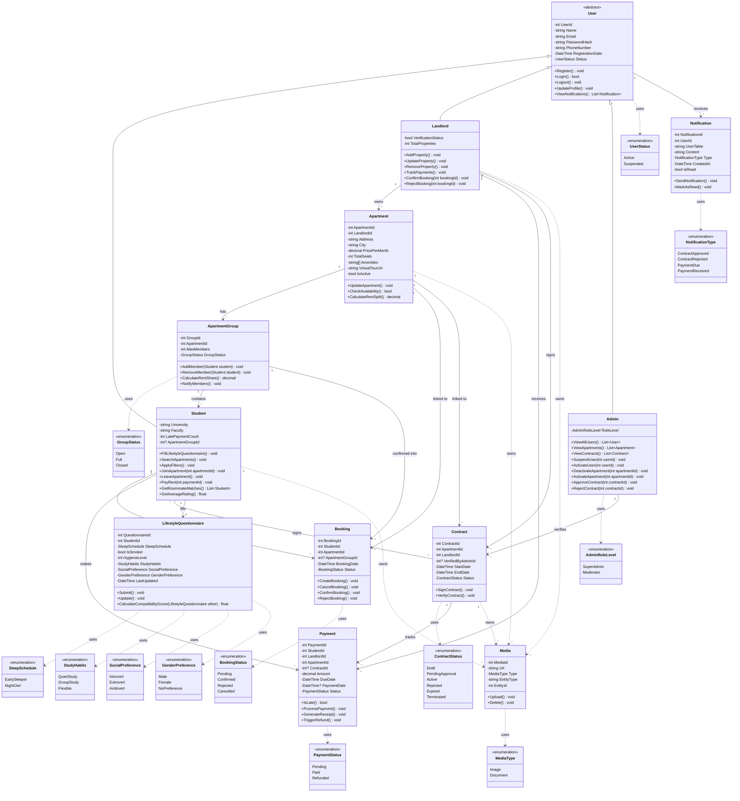

# Sakank | سَكَنَك
## Class Diagram Specification — v3.1 (Targeted Refinements)

> **This document is an in-place update of v3. Do NOT rewrite from scratch.**
> All v3 decisions are preserved unless explicitly overridden below.
> Safe to hand off to any AI model or developer as a self-contained reference.

---

# PART 1 — CHANGE LOG

## v2 → v3 (carried forward)

| Topic | v2 | v3 |
|---|---|---|
| Inheritance Strategy | TPH — single `Users` table with `UserType` discriminator | **TPC — separate `Students`, `Landlords`, `Admins` tables** |
| `UserType` enum | Present (discriminator) | **Removed** |
| Abstract `User` | ✅ | ✅ (kept, TPC) |

**Classes removed in v3:** `Chat`, `Message`, `RoommateRating`, `Penalty`

**Enums removed in v3:** `UserType`, `PenaltyReason`

**Enums updated in v3:**

| Enum | v2 | v3 |
|---|---|---|
| `BookingStatus` | Pending, Confirmed, Cancelled | Pending, Confirmed, Rejected, Cancelled |
| `PaymentStatus` | Pending, Paid, Late, Refunded | Pending, Paid, Refunded |
| `ContractStatus` | Draft, PendingSignature, Active, Expired, Terminated | Draft, PendingApproval, Active, Rejected, Expired, Terminated |
| `NotificationType` | Message, RoommateJoined, Payment, Contract, PenaltyIssued | ContractApproved, ContractRejected, PaymentDue, PaymentReceived |

---

## v3 → v3.1 (this version)

| # | Change | Scope |
|---|---|---|
| 1 | `Booking.ApartmentGroupId : int?` added — booking explicitly links to a group on confirmation | Booking class, lifecycle, Mermaid, relationships |
| 2 | Contract consistency constraint — students must belong to same group/apartment | Contract section note |
| 3 | Payment consistency constraint — payment must match contract's student + apartment | Payment section note |
| 4 | `Admin.ViewUsers()` renamed to `ViewAllUsers()` | Admin class, Mermaid |
| 5 | `Media` class + `MediaType` enum added — media generalized away from entities | New class, new enum, removed scattered URL fields |
| 5a | Removed `Student.ProfileImageUrl`, `Landlord.ProfileImageUrl` | Student, Landlord, Mermaid |
| 5b | Removed `Apartment.ImageUrls` | Apartment, Mermaid, EF notes |
| 5c | Removed `Contract.DocumentUrl` | Contract, Mermaid |
| 6 | `Notification.UserTable : string` added — resolves TPC target table in BLL | Notification class, Mermaid, EF notes |
| 7 | `ApartmentGroup` constraint — only ONE group may be `Open` per apartment at a time | ApartmentGroup section note |
| 8 | `Payment.PaymentStatus` → renamed to `Status` | Payment class, Mermaid, EF notes |
| 8 | `Contract.ContractStatus` → renamed to `Status` | Contract class, Mermaid, EF notes |

---

---

# PART 2 — ENUM DEFINITIONS

---

## `UserStatus`
Controls account standing. Used for safe moderation (no hard delete).

| Value | Meaning |
|---|---|
| `Active` | Account is operational |
| `Suspended` | Restricted by admin — cannot log in or perform actions |

---

## `AdminRoleLevel`
Defines permission tier within the Admin role.

| Value | Meaning |
|---|---|
| `SuperAdmin` | Full moderation control |
| `Moderator` | Limited oversight — can view but may have restricted actions |

---

## `GroupStatus`
Lifecycle state of an `ApartmentGroup`.

| Value | Meaning |
|---|---|
| `Open` | Accepting new members up to `MaxMembers` |
| `Full` | All seats filled |
| `Closed` | Manually closed or tenant cycle ended |

---

## `BookingStatus`
Lifecycle of a booking request.

| Value | Who Sets It | Meaning |
|---|---|---|
| `Pending` | System (on creation) | Awaiting landlord action |
| `Confirmed` | Landlord | Landlord accepted — triggers student joining group via `Booking.ApartmentGroupId` |
| `Rejected` | Landlord | Landlord declined the request |
| `Cancelled` | Student | Student withdrew the request |

---

## `PaymentStatus`
State of a single payment record.

| Value | Meaning |
|---|---|
| `Pending` | Payment created, not yet paid |
| `Paid` | Successfully processed |
| `Refunded` | Payment reversed |

> ⚠️ **Lateness is NOT stored.** Computed at query time:
> `isLate = DateTime.UtcNow > payment.DueDate && payment.Status != PaymentStatus.Paid`

---

## `ContractStatus`
Full lifecycle of a rental contract.

| Value | Who Sets It | Meaning |
|---|---|---|
| `Draft` | System | Created but not yet submitted for approval |
| `PendingApproval` | System | Submitted to admin for review |
| `Active` | Admin (`ApproveContract`) | Approved and in force |
| `Rejected` | Admin (`RejectContract`) | Admin declined — requires revision |
| `Expired` | System | `EndDate` passed naturally |
| `Terminated` | Any party | Ended before natural expiry |

---

## `NotificationType`
Scoped to contract and payment events only (MVP).

| Value | Trigger |
|---|---|
| `ContractApproved` | Admin calls `ApproveContract()` |
| `ContractRejected` | Admin calls `RejectContract()` |
| `PaymentDue` | System — `DueDate` approaching or passed |
| `PaymentReceived` | Payment `Status` transitions to `Paid` |

---

## `MediaType` *(NEW v3.1)*
Classifies the kind of media stored in a `Media` record.

| Value | Meaning |
|---|---|
| `Image` | Photo — e.g. apartment photos, profile pictures |
| `Document` | File — e.g. signed contract PDF |

---

## `SleepSchedule`
Used in `LifestyleQuestionnaire`.

| Value | Meaning |
|---|---|
| `EarlySleeper` | Sleeps and wakes early |
| `NightOwl` | Stays up and sleeps late |

---

## `StudyHabits`
Used in `LifestyleQuestionnaire`.

| Value | Meaning |
|---|---|
| `QuietStudy` | Needs silence |
| `GroupStudy` | Prefers studying with others |
| `Flexible` | Adapts to environment |

---

## `SocialPreference`
Used in `LifestyleQuestionnaire`.

| Value | Meaning |
|---|---|
| `Introvert` | Prefers quiet, low-social home |
| `Extrovert` | Enjoys high social activity |
| `Ambivert` | Comfortable with both |

---

## `GenderPreference`
Used in `LifestyleQuestionnaire`.

| Value | Meaning |
|---|---|
| `Male` | Prefers male-only roommates |
| `Female` | Prefers female-only roommates |
| `NoPreference` | Open to any gender |

---

---

# PART 3 — CLASS SPECIFICATIONS

---

## 3.1 `User` — Abstract Base Class

> TPC: Not mapped to its own table. All columns are duplicated into `Students`, `Landlords`, `Admins`.

### Attributes
| Access | Type | Name | Notes |
|---|---|---|---|
| private | `int` | `UserId` | PK — auto-generated per concrete table |
| private | `string` | `Name` | Full name |
| private | `string` | `Email` | Unique per table |
| private | `string` | `PasswordHash` | Bcrypt / Argon2 hash |
| private | `string` | `PhoneNumber` | |
| private | `DateTime` | `RegistrationDate` | Set on creation |
| private | `UserStatus` | `Status` | Default: `Active` |

### Methods
| Access | Return | Signature |
|---|---|---|
| public | `void` | `Register()` |
| public | `bool` | `Login()` |
| public | `void` | `Logout()` |
| public | `void` | `UpdateProfile()` |
| public | `List<Notification>` | `ViewNotifications()` |

### Navigation Properties
| Property | Type | Direction | Notes |
|---|---|---|---|
| `Notifications` | `ICollection<Notification>` | One → Many | FK: `Notification.UserId` |

---

## 3.2 `Student` — Inherits `User`

### Attributes
| Access | Type | Name | Notes |
|---|---|---|---|
| private | `string` | `University` | |
| private | `string` | `Faculty` | |
| private | `int` | `LatePaymentCount` | Incremented by BLL when computed late |
| private | `int?` | `ApartmentGroupId` | Nullable FK — set by BLL only when `Booking.Status == Confirmed` |

> ✅ `ProfileImageUrl` **removed** in v3.1 — use `Media` records with `EntityType = "Student"` and `Type = Image` instead.

### Methods
| Access | Return | Signature |
|---|---|---|
| public | `void` | `FillLifestyleQuestionnaire()` |
| public | `void` | `SearchApartments()` |
| public | `void` | `ApplyFilters()` |
| public | `void` | `JoinApartment(int apartmentId)` |
| public | `void` | `LeaveApartment()` |
| public | `void` | `PayRent(int paymentId)` |
| public | `List<Student>` | `GetRoommateMatches()` |
| public | `float` | `GetAverageRating()` |

### Navigation Properties
| Property | Type | Direction | Notes |
|---|---|---|---|
| `ApartmentGroup` | `ApartmentGroup?` | Many → One | FK: `Student.ApartmentGroupId` |
| `Bookings` | `ICollection<Booking>` | One → Many | FK: `Booking.StudentId` |
| `Payments` | `ICollection<Payment>` | One → Many | FK: `Payment.StudentId` |
| `Contracts` | `ICollection<Contract>` | Many ↔ Many | Join table: `ContractStudents` |
| `Questionnaire` | `LifestyleQuestionnaire?` | One → One | FK: `LifestyleQuestionnaire.StudentId` |
| `Media` | `ICollection<Media>` | One → Many | Resolved via `Media.EntityType = "Student"` and `Media.EntityId = UserId` |

> ⚠️ **Business Rule:** `ApartmentGroupId` is set ONLY by the BLL when `Booking.Status` transitions to `Confirmed`. It is never set directly on the entity from the presentation layer.
> A student may belong to **at most one active group** at a time — enforced by BLL before calling `AddMember()`.

---

## 3.3 `Landlord` — Inherits `User`

### Attributes
| Access | Type | Name | Notes |
|---|---|---|---|
| private | `bool` | `VerificationStatus` | Must be verified before listing apartments |
| private | `int` | `TotalProperties` | Computed or maintained by BLL |

> ✅ `ProfileImageUrl` **removed** in v3.1 — use `Media` records with `EntityType = "Landlord"` and `Type = Image` instead.

### Methods
| Access | Return | Signature |
|---|---|---|
| public | `void` | `AddProperty()` |
| public | `void` | `UpdateProperty()` |
| public | `void` | `RemoveProperty()` |
| public | `void` | `TrackPayments()` |
| public | `void` | `ConfirmBooking(int bookingId)` |
| public | `void` | `RejectBooking(int bookingId)` |

### Navigation Properties
| Property | Type | Direction | Notes |
|---|---|---|---|
| `Apartments` | `ICollection<Apartment>` | One → Many | FK: `Apartment.LandlordId` |
| `Payments` | `ICollection<Payment>` | One → Many | FK: `Payment.LandlordId` |
| `Contracts` | `ICollection<Contract>` | One → Many | FK: `Contract.LandlordId` |
| `Media` | `ICollection<Media>` | One → Many | Resolved via `Media.EntityType = "Landlord"` and `Media.EntityId = UserId` |

---

## 3.4 `Admin` — Inherits `User`

> Minimal, safe moderation role. No hard deletes. No penalty management.

### Attributes
| Access | Type | Name | Notes |
|---|---|---|---|
| private | `AdminRoleLevel` | `RoleLevel` | `SuperAdmin` or `Moderator` |

### Methods
| Access | Return | Signature | Action |
|---|---|---|---|
| public | `List<User>` | `ViewAllUsers()` | Returns all students & landlords *(renamed from `ViewUsers()` in v3.1)* |
| public | `List<Apartment>` | `ViewApartments()` | Returns all apartments |
| public | `List<Contract>` | `ViewContracts()` | Returns all contracts |
| public | `void` | `SuspendUser(int userId)` | Sets `User.Status = Suspended` |
| public | `void` | `ActivateUser(int userId)` | Sets `User.Status = Active` |
| public | `void` | `DeactivateApartment(int apartmentId)` | Sets `Apartment.IsActive = false` |
| public | `void` | `ActivateApartment(int apartmentId)` | Sets `Apartment.IsActive = true` |
| public | `void` | `ApproveContract(int contractId)` | Sets `Contract.Status = Active`, triggers `ContractApproved` notification |
| public | `void` | `RejectContract(int contractId)` | Sets `Contract.Status = Rejected`, triggers `ContractRejected` notification |

### Navigation Properties
| Property | Type | Direction | Notes |
|---|---|---|---|
| `VerifiedContracts` | `ICollection<Contract>` | One → Many | FK: `Contract.VerifiedByAdminId` |

---

## 3.5 `Apartment`

### Attributes
| Access | Type | Name | Notes |
|---|---|---|---|
| private | `int` | `ApartmentId` | PK |
| private | `int` | `LandlordId` | FK → `Landlords.UserId` |
| private | `string` | `Address` | |
| private | `string` | `City` | |
| private | `decimal` | `PricePerMonth` | |
| private | `int` | `TotalSeats` | Max occupancy |
| private | `string[]` | `Amenities` | Stored as JSON array |
| private | `string?` | `VirtualTourUrl` | |
| private | `bool` | `IsActive` | Default: `true`; set to `false` by admin — soft deactivation |

> ✅ `AvailableSeats` **removed** (v3) — computed as `TotalSeats - ActiveGroup?.Students.Count ?? TotalSeats`
> ✅ `ImageUrls` **removed** in v3.1 — use `Media` records with `EntityType = "Apartment"` and `Type = Image` instead.

### Methods
| Access | Return | Signature |
|---|---|---|
| public | `void` | `UpdateApartment()` |
| public | `bool` | `CheckAvailability()` |
| public | `decimal` | `CalculateRentSplit()` |

### Navigation Properties
| Property | Type | Direction | Notes |
|---|---|---|---|
| `Landlord` | `Landlord` | Many → One | FK: `Apartment.LandlordId` |
| `ApartmentGroups` | `ICollection<ApartmentGroup>` | One → Many | One group per tenant cycle |
| `Bookings` | `ICollection<Booking>` | One → Many | FK: `Booking.ApartmentId` |
| `Contracts` | `ICollection<Contract>` | One → Many | FK: `Contract.ApartmentId` |
| `Media` | `ICollection<Media>` | One → Many | Resolved via `Media.EntityType = "Apartment"` and `Media.EntityId = ApartmentId` |

---

## 3.6 `ApartmentGroup`

> Represents a **single tenant cycle**. A new group is created each time a new cohort of tenants occupies the apartment.

### Attributes
| Access | Type | Name | Notes |
|---|---|---|---|
| private | `int` | `GroupId` | PK |
| private | `int` | `ApartmentId` | FK → `Apartments.ApartmentId` |
| private | `int` | `MaxMembers` | Hard cap — enforced by BLL |
| private | `GroupStatus` | `GroupStatus` | Default: `Open` |

> ✅ `CurrentMembers` **removed** (v3) — computed as `Students.Count`

> ⚠️ **Constraint (v3.1):** Only **one** `ApartmentGroup` with `GroupStatus = Open` is allowed per `Apartment` at any time. Enforced in BLL before creating a new group: if an `Open` group already exists for that `ApartmentId`, creation must be rejected.

### Methods
| Access | Return | Signature |
|---|---|---|
| public | `void` | `AddMember(Student student)` |
| public | `void` | `RemoveMember(Student student)` |
| public | `decimal` | `CalculateRentShare()` |
| public | `void` | `NotifyMembers()` |

### Navigation Properties
| Property | Type | Direction | Notes |
|---|---|---|---|
| `Apartment` | `Apartment` | Many → One | FK: `ApartmentGroup.ApartmentId` |
| `Students` | `ICollection<Student>` | One → Many | FK: `Student.ApartmentGroupId` |
| `Bookings` | `ICollection<Booking>` | One → Many | FK: `Booking.ApartmentGroupId` *(NEW v3.1)* |

---

## 3.7 `Booking`

### Attributes
| Access | Type | Name | Notes |
|---|---|---|---|
| private | `int` | `BookingId` | PK |
| private | `int` | `StudentId` | FK → `Students.UserId` |
| private | `int` | `ApartmentId` | FK → `Apartments.ApartmentId` |
| private | `int?` | `ApartmentGroupId` | *(NEW v3.1)* — nullable FK → `ApartmentGroups.GroupId`; set when landlord confirms |
| private | `DateTime` | `BookingDate` | Set on creation |
| private | `BookingStatus` | `Status` | Default: `Pending` |

> ⚠️ **Booking → Group Link (v3.1):**
> When `Landlord.ConfirmBooking()` is called, the BLL sets `Booking.ApartmentGroupId` to the target group's ID. The student is then added to that group through the booking record — not implicitly from `Student.ApartmentGroupId` alone. `Student.ApartmentGroupId` is subsequently synced by the BLL as a convenience FK for fast "current group" queries.

### Methods
| Access | Return | Signature |
|---|---|---|
| public | `void` | `CreateBooking()` |
| public | `void` | `CancelBooking()` |
| public | `void` | `ConfirmBooking()` |
| public | `void` | `RejectBooking()` |

### Navigation Properties
| Property | Type | Direction | Notes |
|---|---|---|---|
| `Student` | `Student` | Many → One | FK: `Booking.StudentId` |
| `Apartment` | `Apartment` | Many → One | FK: `Booking.ApartmentId` |
| `ApartmentGroup` | `ApartmentGroup?` | Many → One | FK: `Booking.ApartmentGroupId` (nullable) *(NEW v3.1)* |

---

## 3.8 `Payment`

### Attributes
| Access | Type | Name | Notes |
|---|---|---|---|
| private | `int` | `PaymentId` | PK |
| private | `int` | `StudentId` | FK → `Students.UserId` |
| private | `int` | `LandlordId` | FK → `Landlords.UserId` |
| private | `int` | `ApartmentId` | FK → `Apartments.ApartmentId` |
| private | `int?` | `ContractId` | Nullable FK → `Contracts.ContractId` |
| private | `decimal` | `Amount` | |
| private | `DateTime` | `DueDate` | Required — when payment is due |
| private | `DateTime?` | `PaymentDate` | Null until paid |
| private | `PaymentStatus` | `Status` | Default: `Pending` *(renamed from `PaymentStatus` in v3.1)* |

> ✅ `Late` **removed** (v3) — computed at query time:
> ```csharp
> [NotMapped]
> bool IsLate => DateTime.UtcNow > DueDate && Status != PaymentStatus.Paid;
> ```

> ⚠️ **Consistency Constraint (v3.1):** When `ContractId != null`, the BLL MUST verify:
> - `Payment.StudentId` is one of the students listed in `Contract.Students`
> - `Payment.ApartmentId == Contract.ApartmentId`
>
> Payments that violate either condition must be rejected in the service layer.

### Methods
| Access | Return | Signature |
|---|---|---|
| public | `bool` | `IsLate()` |
| public | `void` | `ProcessPayment()` |
| public | `void` | `GenerateReceipt()` |
| public | `void` | `TriggerRefund()` |

### Navigation Properties
| Property | Type | Direction | Notes |
|---|---|---|---|
| `Student` | `Student` | Many → One | FK: `Payment.StudentId` |
| `Landlord` | `Landlord` | Many → One | FK: `Payment.LandlordId` |
| `Apartment` | `Apartment` | Many → One | FK: `Payment.ApartmentId` |
| `Contract` | `Contract?` | Many → One | FK: `Payment.ContractId` (nullable) |

---

## 3.9 `Contract`

### Attributes
| Access | Type | Name | Notes |
|---|---|---|---|
| private | `int` | `ContractId` | PK |
| private | `int` | `ApartmentId` | FK → `Apartments.ApartmentId` |
| private | `int` | `LandlordId` | FK → `Landlords.UserId` |
| private | `int?` | `VerifiedByAdminId` | Nullable FK → `Admins.UserId` — set on approval/rejection |
| private | `DateTime` | `StartDate` | |
| private | `DateTime` | `EndDate` | |
| private | `ContractStatus` | `Status` | Default: `Draft` *(renamed from `ContractStatus` in v3.1)* |

> ✅ `DocumentUrl` **removed** in v3.1 — use `Media` records with `EntityType = "Contract"` and `Type = Document` instead.

> ⚠️ **Consistency Constraint (v3.1):** All students in `Contract.Students` (the `ContractStudents` join table) MUST:
> 1. Belong to an `ApartmentGroup` where `ApartmentGroup.ApartmentId == Contract.ApartmentId`
> 2. Be members of the **same** `ApartmentGroup`
>
> The BLL must enforce this before persisting a contract. Contracts referencing students from different groups or different apartments are invalid.

### Methods
| Access | Return | Signature |
|---|---|---|
| public | `void` | `SignContract()` |
| public | `void` | `VerifyContract()` |

### Navigation Properties
| Property | Type | Direction | Notes |
|---|---|---|---|
| `Apartment` | `Apartment` | Many → One | FK: `Contract.ApartmentId` |
| `Landlord` | `Landlord` | Many → One | FK: `Contract.LandlordId` |
| `VerifiedByAdmin` | `Admin?` | Many → One | FK: `Contract.VerifiedByAdminId` (nullable) |
| `Students` | `ICollection<Student>` | Many ↔ Many | Join table: `ContractStudents(ContractId, StudentId)` |
| `Payments` | `ICollection<Payment>` | One → Many | FK: `Payment.ContractId` |
| `Media` | `ICollection<Media>` | One → Many | Resolved via `Media.EntityType = "Contract"` and `Media.EntityId = ContractId` |

---

## 3.10 `Notification`

> Minimal system — contract and payment events only.

### Attributes
| Access | Type | Name | Notes |
|---|---|---|---|
| private | `int` | `NotificationId` | PK |
| private | `int` | `UserId` | ID of the recipient user |
| private | `string` | `UserTable` | *(NEW v3.1)* — `"Students"`, `"Landlords"`, or `"Admins"`. Used by BLL to resolve the correct TPC table |
| private | `string` | `Content` | Human-readable message body |
| private | `NotificationType` | `Type` | Scoped to 4 event types |
| private | `DateTime` | `CreatedAt` | |
| private | `bool` | `IsRead` | Default: `false` |

> ℹ️ **TPC Note:** Because `Students`, `Landlords`, and `Admins` live in separate tables, no DB-level FK can be enforced on `Notification.UserId` across all three. The `UserTable` field tells the BLL which table to query when resolving the recipient. See EF Core notes (§7.8).

### Methods
| Access | Return | Signature |
|---|---|---|
| public | `void` | `SendNotification()` |
| public | `void` | `MarkAsRead()` |

### Navigation Properties
| Property | Type | Direction | Notes |
|---|---|---|---|
| `User` | `User` | Many → One | Not enforced at DB level — resolved in BLL using `UserTable` |

---

## 3.11 `LifestyleQuestionnaire`

> Core engine of the roommate matching system. One per student.

### Attributes
| Access | Type | Name | Notes |
|---|---|---|---|
| private | `int` | `QuestionnaireId` | PK |
| private | `int` | `StudentId` | FK → `Students.UserId` |
| private | `SleepSchedule` | `SleepSchedule` | |
| private | `bool` | `IsSmoker` | |
| private | `int` | `HygieneLevel` | Scale 1–5 |
| private | `StudyHabits` | `StudyHabits` | |
| private | `SocialPreference` | `SocialPreference` | |
| private | `GenderPreference` | `GenderPreference` | |
| private | `DateTime` | `LastUpdated` | |

### Methods
| Access | Return | Signature |
|---|---|---|
| public | `void` | `Submit()` |
| public | `void` | `Update()` |
| public | `float` | `CalculateCompatibilityScore(LifestyleQuestionnaire other)` |

### Navigation Properties
| Property | Type | Direction | Notes |
|---|---|---|---|
| `Student` | `Student` | One → One | FK: `LifestyleQuestionnaire.StudentId` |

---

## 3.12 `Media` *(NEW v3.1)*

> Centralised media storage. Replaces scattered URL fields across entities.
> Any entity can own media records — looked up by `EntityType` + `EntityId`.

### Attributes
| Access | Type | Name | Notes |
|---|---|---|---|
| private | `int` | `MediaId` | PK |
| private | `string` | `Url` | Full URL or relative path to the stored file |
| private | `MediaType` | `Type` | `Image` or `Document` |
| private | `string` | `EntityType` | Owner entity name: `"Student"`, `"Landlord"`, `"Apartment"`, `"Contract"` |
| private | `int` | `EntityId` | PK of the owner entity in its respective table |

> ℹ️ No FK constraint is placed on `EntityId` at the DB level — the same pattern as `Notification.UserId` under TPC. The BLL resolves the owner using `EntityType` + `EntityId` together.

> **Replaced fields:**
> - `Student.ProfileImageUrl` → `Media(EntityType="Student", Type=Image)`
> - `Landlord.ProfileImageUrl` → `Media(EntityType="Landlord", Type=Image)`
> - `Apartment.ImageUrls` → multiple `Media(EntityType="Apartment", Type=Image)` rows
> - `Contract.DocumentUrl` → `Media(EntityType="Contract", Type=Document)`

### Methods
| Access | Return | Signature |
|---|---|---|
| public | `void` | `Upload()` |
| public | `void` | `Delete()` |

### Navigation Properties
None — `Media` is the dependent side. Owners carry a `ICollection<Media>` navigation property resolved in BLL.

---

---

# PART 4 — SYSTEM LIFECYCLE

> Standard happy-path flow. Enforced in BLL.

```
1. LISTING
   ─────────────────────────────────────────────────────────────────
   Landlord.AddProperty()
   → Creates Apartment (IsActive = true)
   → BLL creates initial ApartmentGroup (GroupStatus = Open)
   → CONSTRAINT: only one Open group per apartment allowed at any time

2. SEARCH & BOOKING
   ─────────────────────────────────────────────────────────────────
   Student.SearchApartments() → Student.ApplyFilters()
   → Student creates Booking (Status = Pending, ApartmentGroupId = null)

3. LANDLORD DECISION
   ─────────────────────────────────────────────────────────────────
   Landlord.ConfirmBooking()
   → Booking.Status = Confirmed
   → Booking.ApartmentGroupId = <target group's GroupId>   ← NEW v3.1
   → BLL sets Student.ApartmentGroupId = group.GroupId     ← synced for quick access
   → ApartmentGroup.AddMember(student)
   → If Students.Count == MaxMembers → GroupStatus = Full

   Landlord.RejectBooking()
   → Booking.Status = Rejected  (end of flow for this booking)

4. CONTRACT
   ─────────────────────────────────────────────────────────────────
   Contract created (Status = Draft)
   → CONSTRAINT: all students in ContractStudents must belong to the
     same ApartmentGroup, and that group's ApartmentId must equal
     Contract.ApartmentId — enforced by BLL before saving
   → Landlord signs → Status = PendingApproval
   → Admin.ApproveContract() → Status = Active → ContractApproved notification sent
   → Admin.RejectContract()  → Status = Rejected → ContractRejected notification sent

5. PAYMENTS
   ─────────────────────────────────────────────────────────────────
   System generates Payment records (Status = Pending, DueDate set)
   → If ContractId != null: BLL verifies StudentId ∈ Contract.Students
     AND ApartmentId == Contract.ApartmentId before saving
   → Student.PayRent() → Payment.Status = Paid
   → Landlord sees payments via TrackPayments()
   → IsLate computed: DateTime.UtcNow > DueDate && Status != Paid

6. MODERATION (any time)
   ─────────────────────────────────────────────────────────────────
   Admin.SuspendUser()           → User.Status = Suspended
   Admin.ActivateUser()          → User.Status = Active
   Admin.DeactivateApartment()   → Apartment.IsActive = false
   Admin.ActivateApartment()     → Apartment.IsActive = true
   (No hard deletes at any step)
```

---

---

# PART 5 — FULL RELATIONSHIP OVERVIEW

```
Inheritance (TPC — no shared table)
───────────────────────────────────────────────────────────────
User          <|-- Student       → table: Students
User          <|-- Landlord      → table: Landlords
User          <|-- Admin         → table: Admins

Housing
───────────────────────────────────────────────────────────────
Landlord      (1)  ──▶  (*)  Apartment           : owns
Apartment     (1)  ──▶  (*)  ApartmentGroup      : has (one per tenant cycle)
ApartmentGroup(1)  ──▶  (*)  Student             : contains (FK on Student)

Booking & Payments
───────────────────────────────────────────────────────────────
Student       (1)  ──▶  (*)  Booking             : creates
Apartment     (1)  ──▶  (*)  Booking             : linked to
ApartmentGroup(1)  ──▶  (*)  Booking             : confirmed into  [NEW v3.1]
Student       (1)  ──▶  (*)  Payment             : makes
Landlord      (1)  ──▶  (*)  Payment             : receives
Contract      (1)  ──▶  (*)  Payment             : tracks (nullable FK)

Contracts
───────────────────────────────────────────────────────────────
Apartment     (1)  ──▶  (*)  Contract            : linked to
Landlord      (1)  ──▶  (*)  Contract            : signs
Student       (*)  ──▶  (*)  Contract            : signs (join: ContractStudents)
Admin         (1)  ──▶  (*)  Contract            : verifies

Matching
───────────────────────────────────────────────────────────────
Student       (1)  ──▶  (1)  LifestyleQuestionnaire : fills

Notifications
───────────────────────────────────────────────────────────────
User          (1)  ──▶  (*)  Notification        : receives (resolved via UserTable)

Media [NEW v3.1]
───────────────────────────────────────────────────────────────
Student       (1)  ──▶  (*)  Media               : owns (EntityType="Student")
Landlord      (1)  ──▶  (*)  Media               : owns (EntityType="Landlord")
Apartment     (1)  ──▶  (*)  Media               : owns (EntityType="Apartment")
Contract      (1)  ──▶  (*)  Media               : owns (EntityType="Contract")
```

---

---

# PART 6 — MERMAID CLASS DIAGRAM



---

---

# PART 7 — EF CORE IMPLEMENTATION NOTES

## 7.1 TPC Mapping

```csharp
// Each concrete type gets its own full table.
// No shared "Users" table — columns are duplicated per table.
modelBuilder.Entity<User>().UseTpcMappingStrategy();
modelBuilder.Entity<Student>().ToTable("Students");
modelBuilder.Entity<Landlord>().ToTable("Landlords");
modelBuilder.Entity<Admin>().ToTable("Admins");
```

> ⚠️ **TPC & PK Uniqueness:** Use a shared HiLo sequence to prevent PK collisions across tables if you ever query across user types:
> ```csharp
> modelBuilder.HasSequence<int>("UserIdSeq").StartsAt(1).IncrementsBy(1);
> modelBuilder.Entity<Student>().Property(s => s.UserId).HasDefaultValueSql("NEXT VALUE FOR UserIdSeq");
> modelBuilder.Entity<Landlord>().Property(l => l.UserId).HasDefaultValueSql("NEXT VALUE FOR UserIdSeq");
> modelBuilder.Entity<Admin>().Property(a => a.UserId).HasDefaultValueSql("NEXT VALUE FOR UserIdSeq");
> ```

---

## 7.2 Enum Conversions (store as string)

```csharp
modelBuilder.Entity<Student>().Property(s => s.Status).HasConversion<string>();
modelBuilder.Entity<Landlord>().Property(l => l.Status).HasConversion<string>();
modelBuilder.Entity<Admin>().Property(a => a.Status).HasConversion<string>();
modelBuilder.Entity<Admin>().Property(a => a.RoleLevel).HasConversion<string>();
modelBuilder.Entity<ApartmentGroup>().Property(g => g.GroupStatus).HasConversion<string>();
modelBuilder.Entity<Booking>().Property(b => b.Status).HasConversion<string>();
modelBuilder.Entity<Payment>().Property(p => p.Status).HasConversion<string>();          // renamed
modelBuilder.Entity<Contract>().Property(c => c.Status).HasConversion<string>();         // renamed
modelBuilder.Entity<Notification>().Property(n => n.Type).HasConversion<string>();
modelBuilder.Entity<Media>().Property(m => m.Type).HasConversion<string>();              // NEW
modelBuilder.Entity<LifestyleQuestionnaire>().Property(q => q.SleepSchedule).HasConversion<string>();
modelBuilder.Entity<LifestyleQuestionnaire>().Property(q => q.StudyHabits).HasConversion<string>();
modelBuilder.Entity<LifestyleQuestionnaire>().Property(q => q.SocialPreference).HasConversion<string>();
modelBuilder.Entity<LifestyleQuestionnaire>().Property(q => q.GenderPreference).HasConversion<string>();
```

---

## 7.3 JSON Column — Apartment.Amenities

```csharp
// Apartment.ImageUrls removed in v3.1 — replaced by Media table.
modelBuilder.Entity<Apartment>()
    .Property(a => a.Amenities)
    .HasConversion(
        v => JsonSerializer.Serialize(v, (JsonSerializerOptions?)null),
        v => JsonSerializer.Deserialize<string[]>(v, (JsonSerializerOptions?)null)!
    )
    .HasColumnType("nvarchar(max)");
```

---

## 7.4 Many-to-Many: Contract ↔ Student

```csharp
modelBuilder.Entity<Contract>()
    .HasMany(c => c.Students)
    .WithMany(s => s.Contracts)
    .UsingEntity(j => j.ToTable("ContractStudents"));
```

---

## 7.5 Cascade Delete — Avoid Issues

```csharp
// Payment has multiple FKs into different tables — restrict cascade on all
modelBuilder.Entity<Payment>()
    .HasOne(p => p.Student)
    .WithMany(s => s.Payments)
    .HasForeignKey(p => p.StudentId)
    .OnDelete(DeleteBehavior.Restrict);

modelBuilder.Entity<Payment>()
    .HasOne(p => p.Landlord)
    .WithMany(l => l.Payments)
    .HasForeignKey(p => p.LandlordId)
    .OnDelete(DeleteBehavior.Restrict);

// Contract.VerifiedByAdminId is nullable — set null on admin removal
modelBuilder.Entity<Contract>()
    .HasOne(c => c.VerifiedByAdmin)
    .WithMany(a => a.VerifiedContracts)
    .HasForeignKey(c => c.VerifiedByAdminId)
    .OnDelete(DeleteBehavior.SetNull);

// Booking.ApartmentGroupId is nullable — set null if group is deleted
modelBuilder.Entity<Booking>()
    .HasOne(b => b.ApartmentGroup)
    .WithMany(g => g.Bookings)
    .HasForeignKey(b => b.ApartmentGroupId)
    .OnDelete(DeleteBehavior.SetNull);
```

---

## 7.6 Computed Property — IsLate (NOT mapped to DB)

```csharp
// In Payment entity:
[NotMapped]
public bool IsLate => DateTime.UtcNow > DueDate && Status != PaymentStatus.Paid;
```

---

## 7.7 Media Table — No FK Constraint

```csharp
// Media.EntityId is not a DB-level FK — it's a polymorphic reference.
// Do NOT configure HasOne/WithMany for Media → entities.
// Resolution is done in the BLL/service layer using EntityType + EntityId.
// Example query:
//   var images = context.Media
//       .Where(m => m.EntityType == "Apartment" && m.EntityId == apartmentId)
//       .ToList();
```

---

## 7.8 Notification FK Under TPC

```csharp
// Notification.UserId cannot have a DB-level FK across 3 separate tables.
// Do NOT configure a FK for Notification.UserId in EF Core.
// The new UserTable column tells the BLL which table to query:
//   if (notification.UserTable == "Students") → query Students table
//   if (notification.UserTable == "Landlords") → query Landlords table
//   if (notification.UserTable == "Admins")    → query Admins table
// Set UserTable in the BLL when creating notification records.
```

---

## 7.9 Soft Delete Strategy Summary

| Entity | Safe Delete Mechanism |
|---|---|
| `Student` / `Landlord` / `Admin` | `Status = UserStatus.Suspended` |
| `Apartment` | `IsActive = false` |
| `Contract` | `Status = Terminated` or `Rejected` |
| All others | Never deleted — historical records kept |

---

## 7.10 Domain Layer File Structure

```
Sakank.Domain/
├── Sakank.Domain.csproj
├── Entities/
│   ├── User.cs                     ← abstract
│   ├── Student.cs
│   ├── Landlord.cs
│   ├── Admin.cs
│   ├── Apartment.cs
│   ├── ApartmentGroup.cs
│   ├── Booking.cs
│   ├── Payment.cs
│   ├── Contract.cs
│   ├── Notification.cs
│   ├── LifestyleQuestionnaire.cs
│   └── Media.cs                    ← NEW v3.1
└── Enums/
    ├── UserStatus.cs
    ├── AdminRoleLevel.cs
    ├── GroupStatus.cs
    ├── BookingStatus.cs
    ├── PaymentStatus.cs
    ├── ContractStatus.cs
    ├── NotificationType.cs
    ├── MediaType.cs                 ← NEW v3.1
    ├── SleepSchedule.cs
    ├── StudyHabits.cs
    ├── SocialPreference.cs
    └── GenderPreference.cs
```

---

## 7.11 Milestone Status

| Layer | Status |
|---|---|
| **Domain — Enums** | ✅ Complete (12 enums — `MediaType` added) |
| **Domain — Entities** | ✅ Complete (12 entities — `Media` added) |
| **DAL — DbContext & Migrations** | ⏳ Next |
| **DAL — Repositories** | ⏳ Pending |
| **BLL — Services** | ⏳ Pending |
| **Presentation (API)** | ⏳ Pending |
